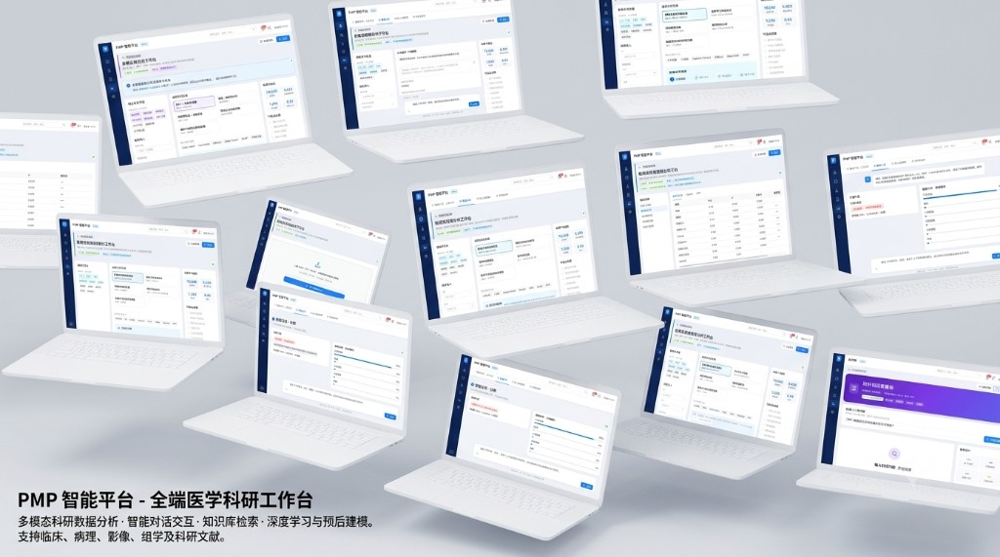

# Mland



**AI-native enterprise agent platform — production-ready code + private deployment recipes that let LLMs ship directly into tier-3 hospital workflows.**

[](LICENSE)
[](https://www.mland.io)
[](https://www.typescriptlang.org/)
[](mcp-server/)
[](docker-compose.yml)

[Quick Start](#quick-start) · [Blueprints](#blueprints) · [Private Deployment](#need-private-deployment-we-ship-it) · [Free vs Pro](#free-vs-pro) · [Docs](https://www.mland.io/docs/getting-started)

---

## What is Mland?

One command gives your AI assistant a complete enterprise agent stack — ReAct orchestrator, healthcare tools, Hospital Adapter, and a full deployment loop from Docker to Kubernetes.

> **Hospitals served:** Chang Gung Hospital · Aerospace Center Hospital
>
> Browse every solution at **[www.mland.io](https://www.mland.io)** — Agent Playground, deploy guides, and Pro pricing in one place.

---

## Need private deployment? We ship it.

The open-source edition gets you 80% of the engineering foundation. For the last 20% — HIS integration, encrypted real-data storage, GPU clusters, and compliance — **we deploy inside your hospital**.

| | |
|---|---|
| ⚡ **2-week PoC** | Run core workflows in your on-prem environment using a Blueprint |
| 🚀 **4–8 week delivery** | Production private deployment — Docker or K8s |
| 🏥 **Pro** | Hospital Adapter, terminology import, 24/7 engineers — **$0.05 / case** |
| 💵 **Enterprise** | Source-level customization, domestic IT stack, data never leaves the hospital |

**Contact:** sales@mland.io · [View Pro pricing](https://www.mland.io/pricing)

---

## Quick Start

### Option 1: MCP Server + Cursor (Recommended)

**Step 1** — Add MCP to Cursor:

```json
{
  "mcpServers": {
    "mland": {
      "command": "npx",
      "args": ["-y", "tsx", "mcp-server/src/index.ts"]
    }
  }
}
```

**Step 2** — Prompt your AI:

- "List all healthcare AI solutions"
- "Deploy the PMP agent for Aerospace Center Hospital"
- "Get the deploy guide for the medical translation assistant"

**Step 3** — One-click deploy:

```
Use mland MCP deploy_solution to deploy pmp-agent on Docker
```

MCP tools: `list_solutions` · `get_solution` · `deploy_solution`

---

### Option 2: CLI

```bash
# PMP project-management agent — Aerospace Center Hospital
npx mland-cli add pmp-agent --hospital=Aerospace-Center-Hospital

# Medical translation assistant — Chang Gung Hospital
npx mland-cli add medical-translation --hospital=Chang-Gung-Hospital

# List all solutions
npx mland-cli list
```

---

### Option 3: Docker infrastructure

```bash
git clone https://github.com/MermaidLiu/Mland.git
cd Mland
docker compose up -d    # Qdrant + Redis + PostgreSQL
npm install
npm run build:packages
npm run dev             # Website at localhost:3000
```

---

## Blueprints

Each Blueprint ships full source code, `.env` templates, `deploy_guide.md`, and Docker Compose configs.

### Healthcare — delivered in production

| Solution | Asset type | Customer | CLI |
|----------|------------|----------|-----|
| **Medical Translation Assistant** | WeChat Mini Program + AI Agent | Chang Gung Hospital | `npx mland-cli add medical-translation --hospital=Chang-Gung-Hospital` |
| **Hospital PMP Agent** | AI Agent | Aerospace Center Hospital | `npx mland-cli add pmp-agent --hospital=Aerospace-Center-Hospital` |

### Cross-industry — open Blueprints

| Solution | Industry | Asset type |
|----------|----------|------------|
| Manufacturing Inspection AI Assistant | Manufacturing | Mobile App |

> Full catalog: [www.mland.io/industries](https://www.mland.io/industries)

---

## Packages

### `@mland/agent` — Agent engine

| Module | Description |
|--------|-------------|
| **Orchestrator** | Native TypeScript ReAct loop (Reason + Act) |
| **Tools** | `medical_translation` · `pmp_calculator` (SPI/CPI/EAC) · `risk_analyzer` |
| **Memory** | `RedisMemory` session store · `VectorMemory` Qdrant abstraction |

### `@mland/core` — Enterprise adapters

| Module | Description |
|--------|-------------|
| **HospitalAdapter** | HIS / PMS integration — patients, projects, translation audit logs |

```typescript
import { HospitalAdapter } from "@mland/core";

const adapter = new HospitalAdapter({
  endpoint: process.env.HIS_API_ENDPOINT!,
  hospitalName: "Aerospace Center Hospital",
});

const projects = await adapter.getProjects();
const patient = await adapter.getPatient("P001");
```

### `@mland/deploy` — Deployment configs

| Tier | Description |
|------|-------------|
| **Docker Compose** | Community single-replica, MIT |
| **K8s (`isPro: true`)** | 3-replica HPA + Prometheus alerts + 24/7 monitoring |

### `mland-cli` — Command-line tool

```bash
npx mland-cli add <slug> [--hospital=Hospital-Name]
npx mland-cli deploy <slug> --env=docker|k8s
npx mland-cli list
```

---

## Directory structure

```
Mland/
├── packages/
│   ├── mland-agent/          # ReAct orchestrator + Tools + Memory
│   │   ├── orchestrator/     #   ReAct Agent
│   │   ├── tools/            #   Medical translation · PMP · Risk
│   │   └── memory/           #   Redis · Vector DB layers
│   ├── mland-core/           # Hospital Adapter (HIS)
│   ├── mland-deploy/         # K8s (Pro)
│   └── mland-cli/            # CLI
├── templates/                # Open Blueprints
│   ├── medical-translation/  #   Chang Gung Hospital
│   ├── pmp-agent/            #   Aerospace Center Hospital
│   └── manufacturing-inspection/
├── mcp-server/               # MCP server (list / get / deploy)
├── src/                      # Marketing site (Next.js)
├── assets/                   # README & docs assets
└── docker-compose.yml        # Qdrant + Redis + PostgreSQL
```

---

## Free vs Pro

All Blueprint agent code is open source (MIT). **Pro adds production-grade capabilities — billed at $0.05 per medical case processed.**

| | Community (Free) | Pro | Enterprise |
|---|---|---|---|
| Blueprint source | ✅ Full MIT | ✅ Enhanced | ✅ Custom fork |
| Demo data | ✅ 10 records | ✅ | ✅ |
| Real EMR / imaging upload | ❌ Blocked | ✅ AES-256 encrypted | ✅ |
| HIS / LIS integration | ❌ | ✅ Custom Hospital Adapter | ✅ On-site |
| Data retention | ❌ Cleared in 24h | ✅ Persistent volumes | ✅ On-prem |
| Inference | CPU | GPU cluster | GPU + domestic stack |
| Deployment | Docker | Docker + HA K8s | Private + compliance |
| Support | Community Issues | Email + tickets | 24/7 dedicated engineers |
| **Pricing** | **$0** | **$0.05 / case** | **Custom** |

> ⚠️ The open-source edition is for learning and PoC only. Real patient data in production requires Pro. See [pricing](https://www.mland.io/pricing).

**Pro billing example:** 10,000 cases/month → **$500/month**. Pay only for cases you process — no idle storage fees.

Pro K8s manifests: `packages/mland-deploy/k8s/` (marked `isPro: true`)

---

## Tech stack

- **Agent:** TypeScript ReAct · LangChain-compatible interfaces
- **Memory:** Redis · Qdrant vector DB
- **Backend:** Next.js 14 · Node.js · FastAPI (templates)
- **Deploy:** Docker Compose · Kubernetes · Vercel
- **AI:** OpenAI / local LLMs · Whisper · RAG
- **Hospital:** Hospital Adapter · HIS / PMS REST APIs

---

## Development

```bash
npm install
docker compose up -d
npm run build:packages
npm run dev
```

Copy environment variables:

```bash
cp .env.local.example .env.local
```

---

## Contributing

Contributions welcome!

1. Fork the repo
2. Create a feature branch (`git checkout -b feature/amazing-feature`)
3. Commit your changes (`git commit -m 'Add amazing feature'`)
4. Push the branch (`git push origin feature/amazing-feature`)
5. Open a Pull Request

### Guidelines

- Keep Blueprint templates under MIT
- Pro configs (`isPro: true`) are not accepted in open-source PRs
- Document hospital-facing features clearly

---

## License

- `templates/` · `packages/mland-agent` · `packages/mland-core` · `mcp-server` — **MIT License**
- `packages/mland-deploy/k8s/` Pro configs — commercial license · [sales@mland.io](mailto:sales@mland.io)

---

**Hospitals served:** Chang Gung Hospital · Aerospace Center Hospital

Made with care for healthcare AI · [www.mland.io](https://www.mland.io)
