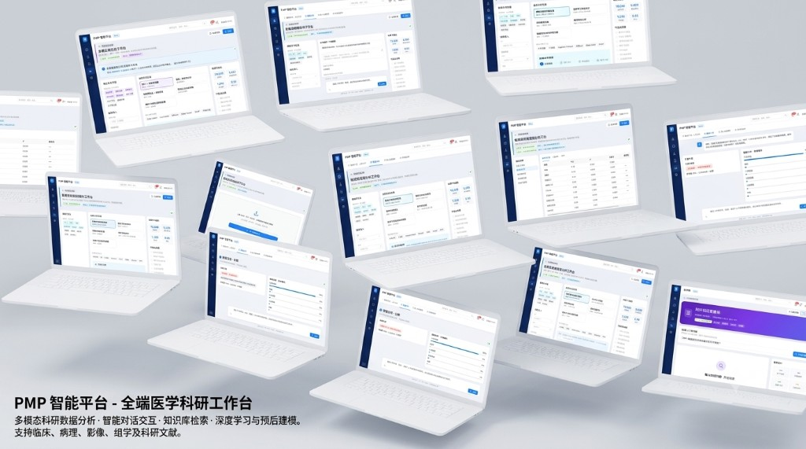

# MedSkill Plaza

English | [简体中文](./README.zh-CN.md)



**A research SKILL plaza for medical students — describe your study in plain language, run packaged tools, and ship SCI-ready outputs. Engineers contribute Docker-wrapped skills; students never touch the code.**

[](LICENSE)
[](https://www.mland.io)
[](https://www.typescriptlang.org/)
[](templates/)
[](mcp-server/)

[What is MedSkill](#what-is-medskill-plaza) · [For Students](#for-medical-students) · [SKILL Catalog](#skill-catalog) · [For Contributors](#for-contributors) · [Quick Start](#quick-start) · [Pricing](#pricing)

---

## What is MedSkill Plaza?

**MedSkill Plaza** is an open platform that helps **medical students produce research** by calling ready-made **SKILLs** — Docker-packaged analysis tools from GitHub, wrapped for one-click use.

> You describe a research goal in natural language → the platform builds a visual workflow → you run proven tools → you get tables, figures, and citations — **without writing code**.

**Two roles, one plaza:**

| Role | What you do | What you see |
|------|-------------|--------------|
| **Medical student** | Upload de-identified data, set research goals, run SKILLs | Visual SOP nodes, SCI previews, compute-coin billing |
| **Contributor (engineer)** | Package a GitHub repo as a Docker SKILL, submit via Git-ops | Source code, `medskill.json` spec, revenue dashboard |

Live demo: **[www.mland.io](https://www.mland.io)** · Bilingual `/en` · `/zh`

---

## For Medical Students

### MedSkill Canvas — Natural Language → Research Workflow

Inspired by **Natural Language to Code-Based Workflow**: students see a canvas; engineers see the code underneath.

1. **Describe your study** — e.g. *"Compare survival between treatment and control groups, output KM curve and Cox regression"*
2. **Upload de-identified data** — CSV / Excel; `Patient_ID` and `Hospital_No` are hashed locally before any run
3. **Generate analysis path** — AI builds a 3-node workflow:
   - **Data preprocessing** — with 🔒 local de-identification badge
   - **Statistical model** — e.g. Cox proportional hazards v1.2, tunable via sliders
   - **SCI outputs** — preview three-line tables and survival curves
4. **Flip to source** — each node has a `</>` toggle: UI for students, R/Python for experts

### Privacy Interceptor

Before every SKILL run, a local scan confirms PHI fields are masked. A compliance badge unlocks execution — **raw patient data never leaves your browser**.

```bash
git clone https://github.com/MermaidLiu/Mland.git
cd Mland
npm install
npm run dev
# → http://localhost:3000/zh
```

---

## SKILL Catalog

Research SKILLs are Docker images built from open-source GitHub tools. Pick one, spend compute coins, get results.

| SKILL | Category | What it does |
|-------|----------|--------------|
| **Cox Proportional Hazards** | Clinical stats | Survival analysis, HR/CI, forest plots, SCI tables |
| **Two-group hypothesis test** | Clinical stats | t-test / Wilcoxon, box plots |
| **DESeq2 RNA-seq** | Omics | Differential expression, volcano & heatmap |
| **GSEA pathway enrichment** | Bioinformatics | GO/KEGG enrichment plots |
| **Academic Search** ([nature-academic-search](https://github.com/wp-a/nature-academic-search)) | Literature | PubMed / CrossRef / arXiv search, citations, MeSH |
| **DICOM lesion segmentation** | Medical imaging | ROI segmentation & volume stats |

```bash
# Example: run Academic Search SKILL
cd templates/nature-academic-search
cp .env.example .env   # set PUBMED_EMAIL
cp data/params.example.json data/params.json
npm run skill:academic-search:build
npm run skill:academic-search:run
```

Browse all SKILLs on the plaza: [www.mland.io](https://www.mland.io) → **SKILL Store** tab.

---

## For Contributors

Package your open-source research tool and earn compute-coin revenue when students run it.

### Git-ops workflow

```
Fork repo → Open PR → CI builds Docker image → Merge → SKILL goes live on the plaza
```

### Contributor Hub features

- Submit **GitHub repo or PR URL**
- Auto-generate **`medskill.json`** (input/output schema for the platform)
- Choose runtime: **Python 3.10 · R 4.3 · Docker**
- Track calls, earnings, and cloud container load

### Package a new SKILL

```bash
# Minimal layout under templates/your-skill/
templates/your-skill/
├── Dockerfile          # clones your GitHub repo
├── run.sh              # reads /data/params.json → writes /data/output/
├── medskill.json       # platform interface spec
├── docker-compose.yml
└── deploy_guide.md
```

See [templates/nature-academic-search/](templates/nature-academic-search/) for a working example.

**Want us to package it for you?** $5,000 down payment · first draft in 1 day · [mermaid_liu@outlook.com](mailto:mermaid_liu@outlook.com)

---

## Quick Start

### Students — use the plaza in browser

```bash
git clone https://github.com/MermaidLiu/Mland.git
cd Mland
npm install
npm run dev
```

Open `http://localhost:3000/zh`, log in as **Medical Student**, and try **MedSkill Canvas**.

### Students — use SKILLs in Cursor

```json
{
  "mcpServers": {
    "mland": {
      "command": "npx",
      "args": ["-y", "tsx", "mcp-server/src/index.ts"]
    }
  }
}
```

Ask your AI: *"List all research SKILLs"* · *"Search PubMed for diabetes cardiovascular mortality"*

### Contributors — publish a SKILL

1. Fork this repo
2. Add your template under `templates/<skill-name>/`
3. Open a PR with `medskill.json` + `Dockerfile`
4. After merge, your SKILL appears in the plaza store

---

## Pricing

MedSkill uses **compute coins** — pay per SKILL run, not per subscription.

| Tier | Who | What you get | Price |
|------|-----|--------------|-------|
| **Free** | Students | Demo data, open-source SKILLs, community support | $0 |
| **Pro** | Students / labs | Real de-identified datasets, GPU inference, encrypted storage | ~$0.05 / case |
| **Contributor** | Engineers | Revenue share when students run your SKILL | % of compute coins |
| **Custom packaging** | Labs / PI | We Docker-wrap your GitHub tool for the plaza | From $5,000 |

> Free tier is for learning and PoC. Upload de-identified data only — the Privacy Interceptor blocks raw PHI.

---

## Project Structure

```
Mland/
├── src/
│   ├── app/[locale]/             # Website (/en, /zh)
│   └── components/medskill/      # MedSkill Plaza SPA
│       ├── canvas-tab.tsx        #   Student workflow canvas
│       ├── skill-store-tab.tsx   #   SKILL marketplace
│       ├── contributor-tab.tsx   #   Git-ops contributor hub
│       └── privacy-interceptor.tsx
├── templates/                    # Docker-wrapped research SKILLs
│   └── nature-academic-search/   #   PubMed / CrossRef / arXiv
├── mcp-server/                   # MCP tools for Cursor / Claude
├── packages/                     # Agent runtime (for advanced SKILLs)
└── docker-compose.yml            # Qdrant + Redis + Postgres
```

---

## Tech Stack

- **Frontend:** Next.js 14 · React · Tailwind CSS · Lucide icons
- **SKILL runtime:** Docker · Python 3.10 · R 4.3
- **AI integration:** MCP Server · Cursor · Claude Code
- **Privacy:** Browser-side PHI hash · local scan before cloud run
- **i18n:** English / 简体中文

---

## Development

```bash
npm install
cp .env.local.example .env.local
npm run dev                  # Plaza at localhost:3000
npm run skill:academic-search:build   # Build a SKILL image
```

---

## Contributing

We welcome research SKILLs from the community!

1. **Students** — report missing analysis types, share use cases
2. **Contributors** — submit Docker-wrapped GitHub tools via PR
3. **Maintainers** — review `medskill.json` schemas and Dockerfiles

All SKILL templates under `templates/` are **MIT License**.

---

## License

- `templates/` · `src/components/medskill/` · `mcp-server/` — **MIT**
- Commercial SKILL packaging & Pro GPU runtime — [mermaid_liu@outlook.com](mailto:mermaid_liu@outlook.com)

---

Built for medical students who want to **do research, not DevOps**.

[www.mland.io](https://www.mland.io) · [GitHub](https://github.com/MermaidLiu/Mland)
